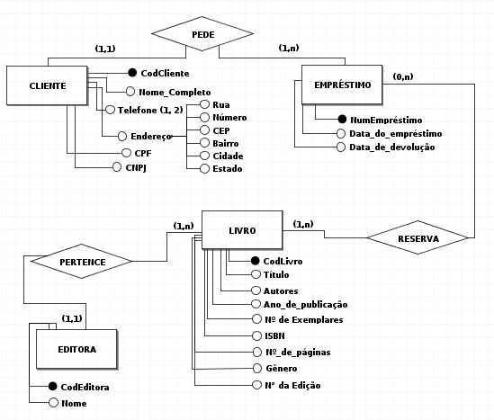
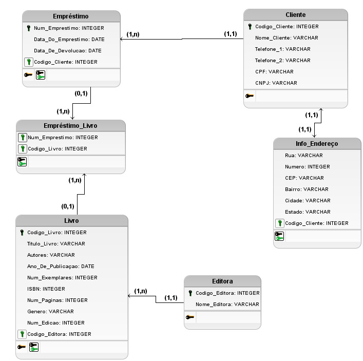

# IBook

Para instalar os módulos necessários utilize o comando:

```
npm install
```

Para inicializar o servidor utilize o comando:

```
npm run dev
```

Para acessar a página inicial da aplicação:

```
http://localhost:5000
```
## Projeto de Software - Sistema de Gestão de Biblioteca

## 📖 Sobre

O objetivo da aplicação IBook é gerir um sistema que permita o cadastro e
organização do acervo da biblioteca de forma que os livros possam ser facilmente 
encontrados, além de também registrar empréstimos que podem ser realizados por 
clientes registrados no sistema.

### Modelo Entidade Relacionamento - Diagrama Conceitual



### Modelo Relacional - Diagrama Lógico



